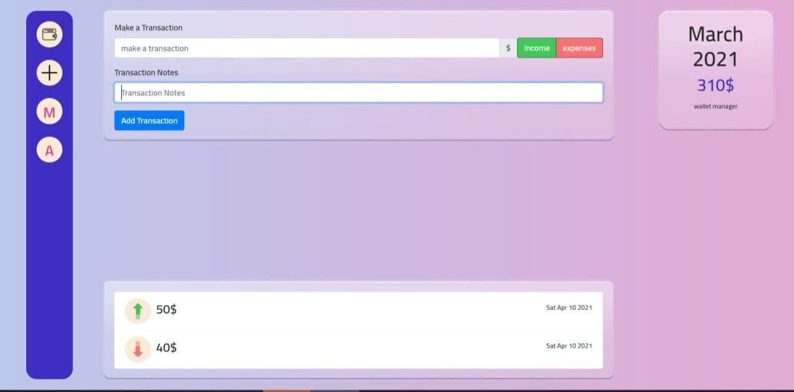

Project Name & Pitch

E-Wallet APP
E-Wallet and transaction manager Where you can add wallets in different types of currencies and manage your incomes and outcomes built with React, JavaScript, and Bootstrap.

Project Status
This project is currently in development. Users may create and manage their wallets but the data has to be persisted somewhere (which is not the case currently) - therefore I'm planning to hook it up with Firebase in the near future.

Project Screen Shot(s)

Home Page 

Wallet Page 

Installation and Setup Instructions
Clone down this repository. You will need node and yarn installed globally on your machine.

Installation:

yarn

To Start Server:

yarn start

To Visit App:

localhost:3000/

Reflection
This app was build as a one of front-end bootcamps hosted by re:coded. Project goals included using technologies learned up until this point and familiarizing myself with documentation for new features all of which has been achieved by leveraging react, react-router-5.0.